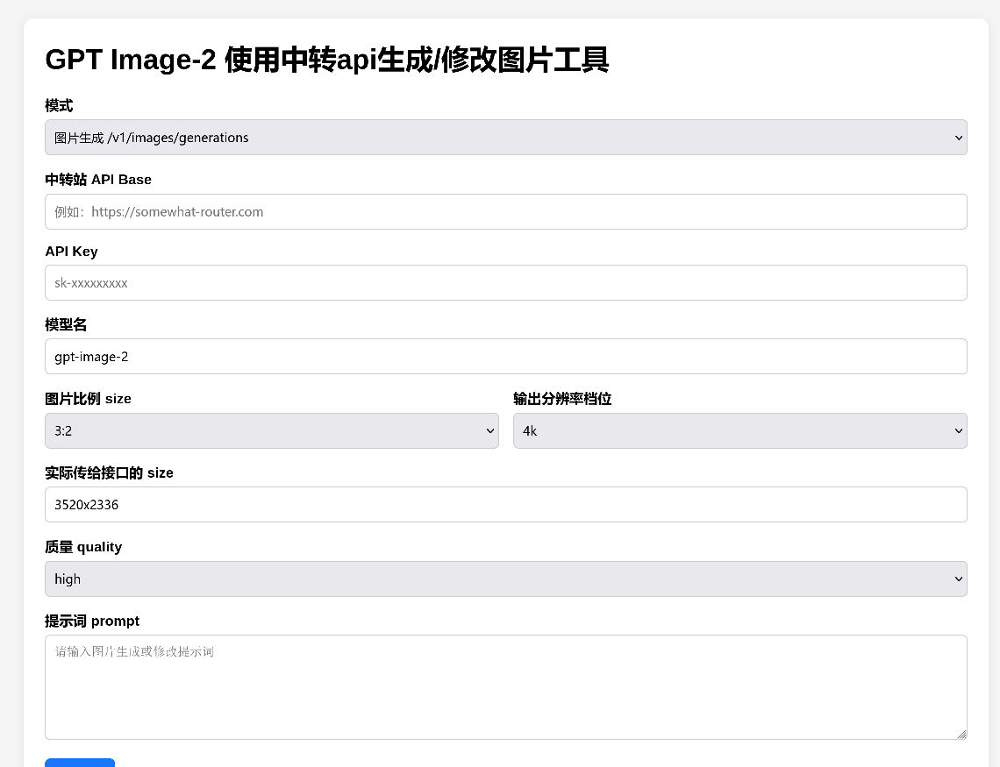

# GPT Image-2 使用中转api生成/修改图片工具

一个本地网页工具，用于通过 OpenAI 兼容接口调用图片生成和图片修改接口。
因为cherrystudio没找到指定image2图片生成尺寸的途径，于是就用gpt-5.5 vibecoding了一个。只在arch下使用过。

## 截图
<p align="center">
  
</p>

## 功能

- 图片生成：`/v1/images/generations`
- 图片修改：`/v1/images/edits`
- 支持自定义 API Base
- 支持自定义 API Key
- 支持自定义模型名
- 支持图片比例和分辨率选择
- 支持多张本地图片上传
- 支持多个远程图片 URL 作为修改/参考图
- 后台任务状态轮询
- 自动保存生成结果到本地 `outputs/`

## 安装

建议使用 Python 虚拟环境。

### Linux / macOS

```bash
python -m venv .venv
source .venv/bin/activate
python -m pip install -r requirements.txt
```

### Windows PowerShell

```powershell
python -m venv .venv
.\.venv\Scripts\Activate.ps1
python -m pip install -r requirements.txt
```

## 运行

```bash
python app.py
```

然后在浏览器中打开：

```text
http://127.0.0.1:7860
```

## 配置

你可以在网页中手动填写以下内容：

- API Base
- API Key
- 模型名

也可以使用环境变量预先设置：

### Linux / macOS

```bash
export IMAGE_API_BASE="https://your-api-base.example.com"
export IMAGE_API_KEY="your-api-key"
export IMAGE_MODEL="gpt-image-2"
python app.py
```

### Windows PowerShell

```powershell
$env:IMAGE_API_BASE="https://your-api-base.example.com"
$env:IMAGE_API_KEY="your-api-key"
$env:IMAGE_MODEL="gpt-image-2"
python app.py
```

## 依赖

```txt
Flask
requests
Pillow
```

## 注意事项

- 图片生成接口是否支持指定尺寸，取决于中转站和模型本身
- 如果出现 `524`，通常是中转站或 Cloudflare 超时，不一定是本地程序问题

## 许可证

本项目采用 [MIT License](LICENSE)。


